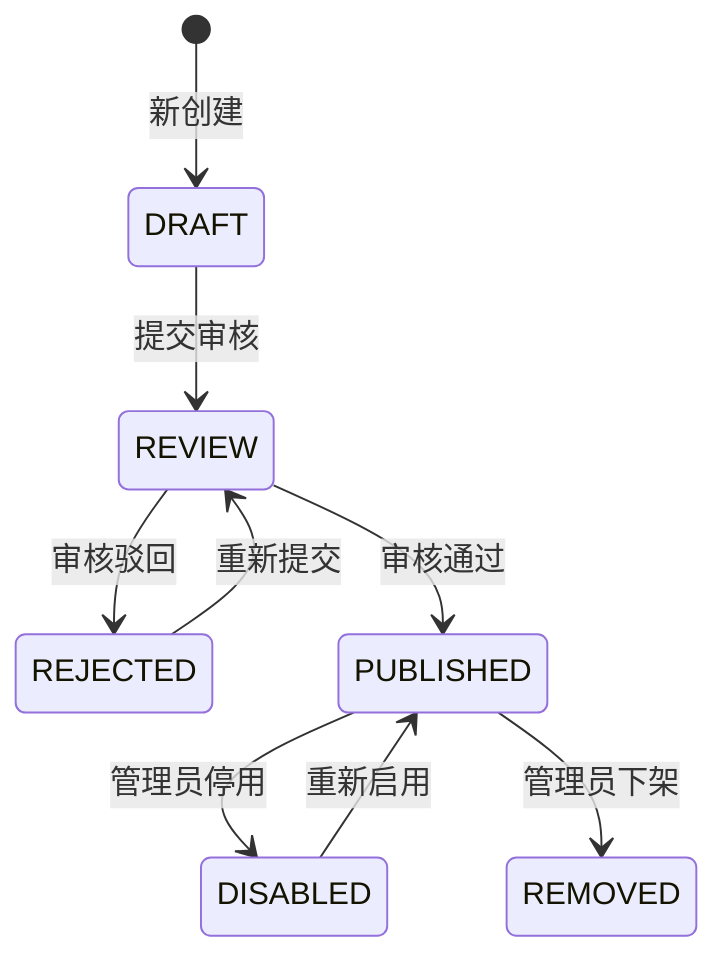
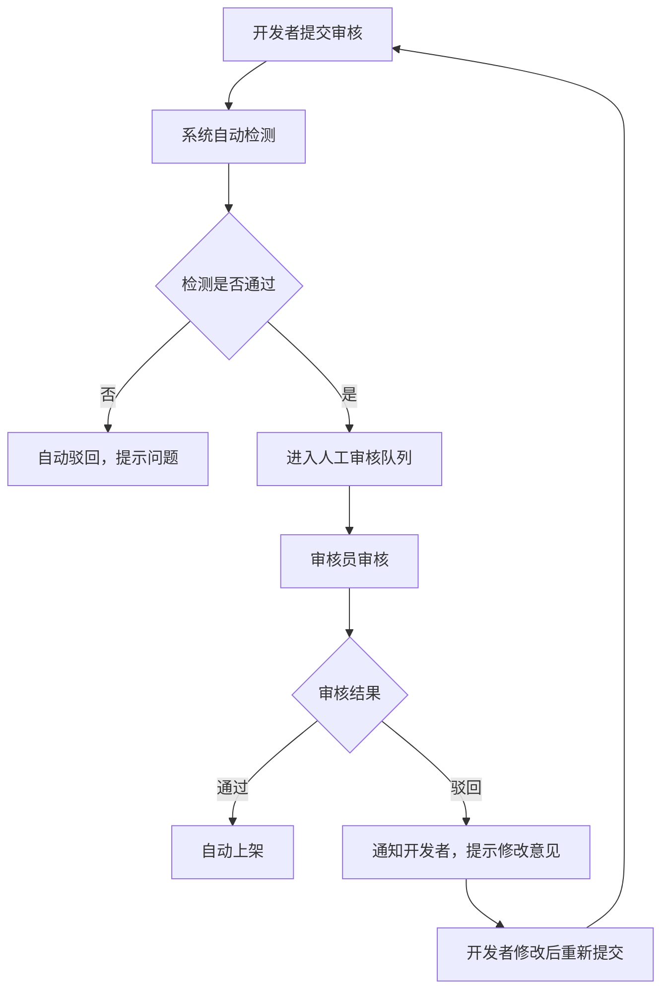
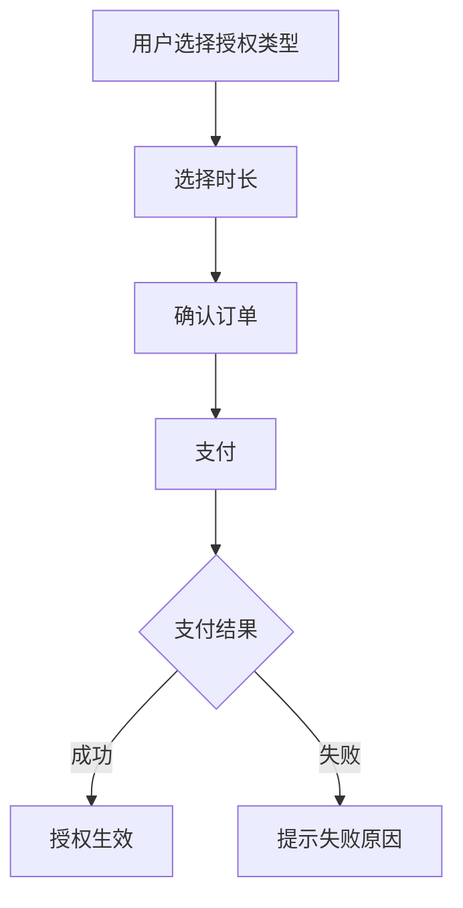
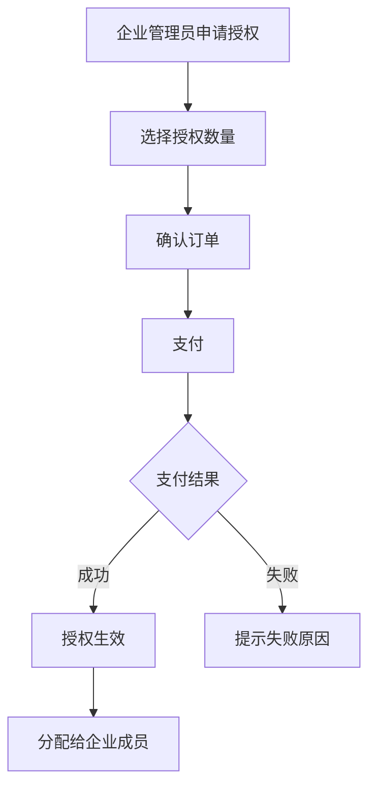

# 📋 PLM App Store 完整产品需求文档（PRD）

**文档版本：** V3.0  
**编制日期：** 2026年5月18日  
**编制人：** AIPM产品经理  
**状态：** 🟢 待评审

---

## 版本历史

| 版本 | 日期 | 修订人 | 修订内容 |
|-----|------|-------|---------|
| V1.0 | 2026-05-14 | AIPM | 初始版本（基础应用商店功能） |
| V2.0 | 2026-05-15 | AIPM | 重大升级：完整生命周期/工具插件区分/OS管理/数据集关联/审核/授权体系 |
| V2.1 | 2026-05-15 | AIPM | ✅ 关键补充：数据集-工具关联打开机制 |
| V3.0 | 2026-05-18 | AIPM | 完整合并：PLM App Store专属PRD + App Store P0 PRD，覆盖所有功能 |

---

## GAP分析（V3.0 完整合并）

| 模块 | PLM版 | App Store版 | V3.0完整合并 |
|-----|--------|-------------|-------------|
| 核心定位 | PLM原生插件扩展中心 | Ragentic Cube Suite工具市场 | 统一平台：PLM+工具+插件一体化市场 |
| 应用类型 | 无区分 | 工具软件/插件分类 | 完整类型体系 |
| 生命周期 | 简单上下架 | 6状态完整流转 | 完整生命周期管理 |
| 数据集关联 | 缺失 | ✅ 完整机制 | 数据集-工具智能关联 |
| 审核流程 | 基本审核 | 完整审核机制 | 完整审核体系 |
| 授权管理 | 租户隔离 | 完整授权体系 | 租户+授权双重管控 |
| OS适配 | 基础兼容 | OS清单+适配配置 | 多系统完整适配 |
| 性能指标 | 明确量化 | 部分提及 | 完整量化指标 |

---

## 目录

1. [文档基础信息](#1-文档基础信息)
2. [产品概述](#2-产品概述)
3. [核心概念定义](#3-核心概念定义)
4. [数据集-工具关联机制【核心】](#4-数据集-工具关联机制核心)
5. [用户角色与场景](#5-用户角色与场景)
6. [核心功能需求](#6-核心功能需求)
7. [生命周期状态机](#7-生命周期状态机)
8. [数据模型设计](#8-数据模型设计)
9. [前台页面设计](#9-前台页面设计)
10. [管理后台设计](#10-管理后台设计)
11. [审核流程](#11-审核流程)
12. [购买授权流程](#12-购买授权流程)
13. [非功能需求](#13-非功能需求)
14. [界面原型与交互说明](#14-界面原型与交互说明)
15. [数据需求](#15-数据需求)
16. [接口需求](#16-接口需求)
17. [测试需求](#17-测试需求)
18. [项目排期与资源需求](#18-项目排期与资源需求)
19. [风险与应对方案](#19-风险与应对方案)
20. [附则](#20-附则)

---

## 1. 文档基础信息

- **文档标题：** PLM App Store V3.0 产品需求文档（PRD）
- **版本与修订：** V3.0（完整合并版本），修订日期：2026-05-18，修订人：AIPM产品经理
- **适用范围：** 研发团队（前端/后端）、测试团队、UI/UX设计团队、PLM系统管理员、产品团队
- **前置依赖：** PLM App Store功能清单（含优先级）、PLM系统接口文档、目标用户需求调研纪要

---

## 2. 产品概述

### 2.1 核心定位

PLM App Store是PLM系统原生插件扩展中心，也是Ragentic Cube Suite平台的工具应用市场，以元数据驱动为核心，提供标准化、可配置、低代码的应用插件（含研发、合规、协同等场景），实现应用"一键安装、按需配置、租户隔离"，降低企业PLM系统定制开发成本，加速业务场景落地，贴合PLM系统研发管理全流程。

**核心差异化价值：数据集-工具智能关联打开机制**
> 类似Windows"打开方式"，数据集绑定默认工具，一键调用本地已安装的工具客户端打开文件，无缝集成体验。

### 2.2 目标用户（细分+核心需求）

- **PLM系统管理员：** 负责应用上架审核、版本管理、权限分配、用量统计，核心需求是高效管控应用全生命周期，降低管理成本，保障系统安全合规。
- **研发人员（设计/工艺）：** 查找、安装适配的CAD/ECAD集成、BOM管理、仿真数据管理等应用，核心需求是简化操作，提升研发效率，减少重复工作。
- **协同部门用户（采购/质量）：** 使用供应商协同、质量管控类应用，核心需求是实现跨部门数据同步，简化协同流程。
- **企业管理员：** 企业授权内应用可安装，管理企业授权、分配给成员。
- **应用开发者：** 新增/编辑自己的应用、提交审核。
- **审核员：** 审核应用、驳回/通过。
- **系统管理员：** 全部权限：OS管理/分类管理/授权管理/应用下架。

### 2.3 核心目标（可量化）

- **功能目标：** 实现应用查找、安装、管理、审核全流程闭环，覆盖PLM App Store核心应用分类（研发设计、BOM配置、变更合规等）。
- **效率目标：** 应用安装操作步骤≤3步，管理员应用审核响应时间≤2个工作日，应用搜索响应时间≤1秒。
- **体验目标：** 用户操作无专业培训即可上手，应用安装失败率≤1%，系统连续运行72小时无异常。

### 2.4 范围界定（明确做/不做）

- **做：** 核心功能（门户导航、应用管理、管理员后台）、核心应用上架（P1/P2优先级应用）、基础接口开发、兼容性校验、基础数据统计、数据集-工具关联机制、完整生命周期管理、审核流程、授权体系。
- **不做：** 第三方开发商入驻自动化流程、AI辅助工具（P3优先级）、多语言适配（后续迭代）、复杂自定义报表（基础报表优先）。

---

## 3. 核心概念定义

### 3.1 应用类型

| 类型 | 定义 | 示例 |
|------|------|------|
| **工具软件** | 可独立运行的完整应用程序 | CATIA集成客户端、PDQ质检工具 |
| **插件** | 依赖宿主工具运行的功能扩展 | CATIA数据导出插件、PDQ自定义规则包 |

### 3.2 应用状态（6状态）



| 状态码 | 状态名 | 说明 | 前台可见性 |
|-------|-------|------|-----------|
| DRAFT | 草稿 | 编辑中，信息不完整 | ❌ 不可见 |
| REVIEW | 审核中 | 已提交审核，等待管理员处理 | ❌ 不可见 |
| REJECTED | 已驳回 | 审核不通过，需修改后重提 | ❌ 不可见 |
| PUBLISHED | 已发布 | 审核通过，正常上架 | ✅ 可见 |
| DISABLED | 已停用 | 临时下架，保留数据 | ❌ 不可见 |
| REMOVED | 已下架 | 永久下架，历史记录保留 | ❌ 不可见 |

### 3.3 操作系统清单

```
┌─────────────────────────────────────────────────────┐
│              支持的操作系统清单                        │
├─────────────────────────────────────────────────────┤
│                                                         │
│  ┌──────────────────────────────────────────────┐  │
│  │ Windows                                      │  │
│  │  ├── Windows 10 (20H2/21H1/21H2/22H2)       │  │
│  │  ├── Windows 11 (21H2/22H2/23H2)            │  │
│  │  └── Windows Server (2019/2022)              │  │
│  └──────────────────────────────────────────────┘  │
│                                                         │
│  ┌──────────────────────────────────────────────┐  │
│  │ Linux                                        │  │
│  │  ├── CentOS (7/8/9)                          │  │
│  │  ├── Ubuntu (18.04/20.04/22.04)              │  │
│  │  └── Red Hat Enterprise Linux (8/9)           │  │
│  └──────────────────────────────────────────────┘  │
│                                                         │
│  ┌──────────────────────────────────────────────┐  │
│  │ macOS                                        │  │
│  │  ├── macOS 11 Big Sur                        │  │
│  │  ├── macOS 12 Monterey                       │  │
│  │  └── macOS 13 Ventura                        │  │
│  └──────────────────────────────────────────────┘  │
└─────────────────────────────────────────────────────┘
```

---

## 4. 数据集-工具关联机制【核心】

### 4.1 核心设计思想

> 💡 **类似Windows的"打开方式"**
>
> 每个数据集类型有**默认绑定工具**，点击打开时自动检测本地安装状态，授权有效则直接拉起本地工具客户端打开文件，实现无缝体验。

### 4.2 交互流程总图

```mermaid
flowchart TD
    A[用户点击"打开数据集"] --> B{读取数据集default_app_id}
    
    B -->|未配置默认工具| C[弹出"选择打开方式"]
    C --> D[用户选择工具]
    D --> E[可勾选"设为默认打开方式"]
    E --> F{检查授权状态}
    
    B -->|已配置默认工具| F
    
    F -->|未授权| G[提示"需先购买授权"]
    G --> H[跳转到应用商店详情页]
    H --> I[用户完成购买流程]
    I --> J{检查本地安装状态}
    
    F -->|已授权| J
    
    J -->|未安装| K[弹出"立即安装"提示]
    K --> L[自动拉起应用商店安装器]
    L --> M[用户完成安装]
    M --> N[调用本地客户端打开文件]
    
    J -->|已安装| N
    
    N --> O[✓ 文件打开成功]
```

### 4.3 本地客户端调用协议（URL Scheme）

**协议名称：** `ragentic://`

**调用格式示例：**

```bash
# 打开CATIA文件
ragentic://tool/catia/open?dataset_id=xxx-xxx-xxx&token=xxx&file_path=xxx.CATPart

# 打开PDQ检查
ragentic://tool/pdq/check?dataset_id=xxx-xxx-xxx&rule_id=R001

# 通用打开接口
ragentic://tool/{app_code}/open?dataset_id={数据集ID}&token={临时访问令牌}
```

**协议参数说明：**

| 参数 | 必填 | 说明 |
|------|------|------|
| app_code | ✅ | 工具唯一编码（如CATIA, PDQ, BOM等） |
| dataset_id | ✅ | 数据集唯一ID |
| token | ✅ | 临时访问令牌（15分钟有效期） |
| file_path | ✅ | 文件本地路径（首次打开需下载） |
| open_mode | | READ只读/EDIT编辑，默认READ |

### 4.4 数据集表字段补充

**数据表：** `dataset` （数据集主表）

| 新增字段 | 类型 | 必填 | 说明 |
|---------|------|------|------|
| default_app_id | UUID | | 默认打开工具ID，关联app_base表<br>为空则提示用户选择 |
| default_open_mode | VARCHAR(32) | | 默认打开方式：<br>• DEFAULT - 使用默认工具<br>• PROMPT - 每次让用户选择 |
| supported_apps | JSON | | 支持的工具ID列表<br>```["app_id_1", "app_id_2"]``` |

### 4.5 数据集-工具关联关系表

**表名：** `dataset_tool_support`

| 字段名 | 类型 | 必填 | 说明 |
|-------|------|------|------|
| id | UUID | ✅ | 主键 |
| dataset_id | UUID | ✅ | 数据集ID |
| app_id | UUID | ✅ | 支持的工具ID |
| is_default | BOOLEAN | | 是否该数据集类型的默认工具 |
| priority | INT | | 优先级（数字越小越靠前展示） |
| support_start_ver | VARCHAR(32) | | 最低支持版本 |
| support_end_ver | VARCHAR(32) | | 最高支持版本 |
| created_at | DATETIME | ✅ | |

### 4.6 页面交互设计

#### 交互1：打开数据集按钮

```
数据集详情页
┌─────────────────────────────────────────────┐
│ 电机模型.CATPart                         │
├─────────────────────────────────────────────┤
│ [打开]  [下载]  [关联工具▼]               │
│                                           │
│  大小: 15.2 MB | 版本: V1.3             │
│  默认工具: CATIA集成客户端                 │
└─────────────────────────────────────────────┘
```

#### 交互2：选择打开方式弹窗

```
┌─────────────────────────────────────────────────────┐
│                   选择打开方式                    ×  │
├─────────────────────────────────────────────────────┤
│  请选择要使用的工具：                                 │
│                                                         │
│  ┌─────────────────────────────────────────────────┐│
│  │ ✅ CATIA集成客户端                              ││
│  │    已授权 ✓ 已安装 ✓ 最新版本                   ││
│  ├─────────────────────────────────────────────────┤│
│  │   PDQ质检工具                                  ││
│  │    已授权 ✓ 已安装 ✓ 版本更新可用               ││
│  ├─────────────────────────────────────────────────┤│
│  │ ⏳ BOM导出工具                                  ││
│  │    未授权，点击购买 →                          ││
│  └─────────────────────────────────────────────────┘│
│                                                         │
│  [√] 设为默认打开方式，下次不再提示                    │
│                                                         │
│                              [取消]  [确认打开]       │
└─────────────────────────────────────────────────────┘
```

#### 交互3：未授权提示

```
┌─────────────────────────────────────────────────────┐
│                    操作提示                        ×  │
├─────────────────────────────────────────────────────┤
│                                                         │
│          🔐 需要购买授权才能使用此工具                  │
│                                                         │
│  您当前未购买"CATIA集成客户端"的使用授权。             │
│                                                         │
│  价格：¥ 999 / 年 / 用户                                 │
│                                                         │
│  [去应用商店了解详情]  [立即购买]                      │
└─────────────────────────────────────────────────────┘
```

#### 交互4：未安装提示

```
┌─────────────────────────────────────────────────────┐
│                    操作提示                        ×  │
├─────────────────────────────────────────────────────┤
│                                                         │
│          📦 需要安装本地客户端                          │
│                                                         │
│  您还未安装"CATIA集成客户端"，是否立即安装？            │
│                                                         │
│  版本：V2.1.0   大小：125 MB                           │
│                                                         │
│  [取消]  [立即安装]                                   │
└─────────────────────────────────────────────────────┘
```

### 4.7 数据集管理后台关联配置页

```
┌─────────────────────────────────────────────────────────────────┐
│ 数据集类型管理 > 三维模型 > 工具关联配置                      │
├─────────────────────────────────────────────────────────────────┤
│                                                                 │
│  当前数据集类型：CATIA三维模型 (.CATPart/.CATProduct)         │
│                                                                 │
│  [+ 添加支持工具]                                                │
│                                                                 │
│ ┌─────────────────────────────────────────────────────────────┐│
│ │ 工具名称          │ 默认打开 │ 版本范围     │ 优先级 │ 操作  ││
│ ├─────────────────────────────────────────────────────────────┤│
│ │ CATIA集成客户端 │ ✅ 是   │ V2.0.0+     │ 1       │ 编辑/删除 ││
│ │ PDQ质检工具      │ ❌ 否   │ V3.0.0+     │ 2       │ 编辑/删除 ││
│ └─────────────────────────────────────────────────────────────┘│
│                                                                 │
│  说明：优先级越小，在选择列表中越靠前；                        │
│       只有一个工具可设为默认打开方式。                           │
│                                                                 │
│  [保存]                                                         │
└─────────────────────────────────────────────────────────────────┘
```

---

## 5. 用户角色与场景

### 5.1 用户角色矩阵

| 角色 | 前台操作 | 管理后台操作 |
|------|---------|-------------|
| 👤 **普通用户** | 浏览/搜索/购买/安装/评价 | ❌ 无管理权限 |
| 🏢 **企业管理员** | 企业授权内应用可安装 | ✅ 查看企业授权、分配给成员 |
| 👨‍💻 **应用开发者** | 同普通用户 | ✅ 新增/编辑自己的应用、提交审核 |
| 🔍 **审核员** | 同普通用户 | ✅ 审核应用、驳回/通过 |
| ⚙️ **系统管理员** | 同普通用户 | ✅ 全部权限：OS管理/分类管理/授权管理/应用下架 |

### 5.2 核心用户场景

#### 场景1：设计师打开CATIA数据集【核心场景】
> 李工在数据集中看到一个CATIA模型，想直接打开查看。

**用户流程：**
1. 点击数据集"电机模型.CATPart"的【打开】按钮
2. 系统检测已配置默认工具：CATIA集成客户端
3. ✅ 检查授权有效，✅ 检查已安装最新版本
4. 自动调用 `ragentic://tool/catia/open?xxx` 协议
5. 本地CATIA客户端启动，自动加载并打开文件

#### 场景2：研发人员查找并安装CAD集成应用（P1优先级）
> 李工需要安装SolidWorks连接器。

**前置条件：** 研发人员已登录PLM系统，进入App Store板块；

**用户流程：**
1. 点击"研发设计类"分类
2. 筛选"CAD集成"标签、自身PLM系统版本
3. 点击目标应用（如SolidWorks连接器）进入详情页
4. 查看兼容性说明（确认适配自身CAD版本）
5. 点击"一键安装"
6. 等待系统校验兼容性、自动安装

**预期结果：** 安装成功后弹窗提示，应用自动同步至"我的应用"，可直接点击启动使用；若兼容性不匹配，弹窗提示具体原因（如"当前PLM版本不支持该应用，请升级至V8.0及以上"）。

#### 场景3：管理员审核应用上架（P1优先级）
> 管理员需要审核新提交的应用。

**前置条件：** 管理员已登录App Store管理后台，有新的应用上架申请；

**用户流程：**
1. 进入"应用审核"模块
2. 查看待审核应用列表（显示应用名称、开发商、版本、适配PLM版本）
3. 点击应用查看详情（含功能说明、兼容性报告、合规性材料）
4. 核对合规性（是否符合企业数据安全规范）、兼容性（是否适配目标PLM版本）
5. 点击"批准上架"或"驳回"（驳回需填写具体原因）

**预期结果：** 批准后，应用自动同步至App Store首页推荐/对应分类；驳回后，开发商收到驳回通知及原因，可修改后重新提交审核。

#### 场景4：管理员管理已上架应用版本（P1优先级）
> 管理员需要发布新版本应用。

**用户流程：**
1. 进入"版本管理"模块
2. 选择目标应用
3. 上传新版本安装包，填写版本变更说明、兼容性要求
4. 选择"灰度发布"（仅对部分租户开放）或"全量发布"
5. 发布后，已安装该应用的用户收到升级提示

**预期结果：** 版本发布成功，支持用户手动升级；若发布后出现异常，可点击"版本回滚"，恢复至前一稳定版本。

#### 场景5：设计师安装CATIA工具（前台）
> 新用户李工需要安装CATIA集成客户端。

**用户流程：**
1. 打开应用商店
2. 找到"CATIA集成客户端"
3. 查看应用详情（功能介绍、系统要求、用户评价）
4. 确认适配当前系统（系统自动检测提示）
5. 点击"购买"，选择个人授权/1年
6. 完成支付流程
7. 授权生效，按钮变为"立即安装"
8. 自动下载→安装→完成

#### 场景6：管理员发布新PDQ工具（管理后台）
> 管理员需要发布新的PDQ检查工具。

**用户流程：**
1. 进入应用商店管理后台
2. 点击"新增应用"
3. 填写基本信息（名称、分类、图标、描述）
4. 选择应用类型：工具软件
5. 配置OS适配：Windows 10/11，选择版本范围
6. 新增版本：上传安装包、填写版本号、变更日志
7. 配置数据集关联：PDQ规则库、标准库数据集
8. 上传截图/附件
9. 提交审核
10. 审核员审核通过 → 自动上架

---

## 6. 核心功能需求

### 6.1 门户导航模块（P1优先级）

#### 首页门户

- **展示内容：** 顶部搜索框、左侧分类导航（研发设计类、产品结构类、变更合规类等）、中间推荐应用（热门应用、新品应用、行业标杆应用，按点击量/安装量排序）、底部公告栏（新应用上架、版本更新、补丁通知）。
- **交互逻辑：** 点击分类导航，跳转至对应应用列表；点击推荐应用，直接进入应用详情页；公告栏点击可查看完整内容。

#### 搜索与筛选

- **搜索功能：** 支持输入应用名称、关键词（如"CAD集成""BOM管理"），实时联想匹配，搜索结果按相关性排序。
- **筛选功能：** 支持多条件组合筛选，包括：应用分类、行业（汽车/电子/机械）、PLM版本、应用版本、免费/付费、开发商、操作系统。
- **异常逻辑：** 无搜索结果时，显示"暂无匹配应用，可调整筛选条件或尝试其他关键词"提示，并推荐热门应用。

### 6.2 应用管理模块（P1优先级）

#### 应用详情页

- **基础信息：** 应用名称、图标、当前版本、开发商、适配PLM版本、行业标签、更新日期、安装量、应用类型（工具软件/插件）、宿主工具（插件）。
- **详细内容：** 功能亮点、解决痛点、操作说明、兼容性说明（明确适配的CAD/ERP版本、操作系统版本）、权限要求（安装需管理员权限/普通用户权限）。
- **交互操作：** "一键安装""卸载""升级"按钮（安装后显示"卸载""升级"，未安装显示"一键安装"）、"查看评价"入口、"收藏"按钮、"购买授权"按钮（未授权）。

#### 安装/卸载/升级逻辑

- **安装：** 点击"一键安装"→ 系统自动校验当前PLM版本、终端兼容性 → 校验通过，自动下载安装（显示安装进度）→ 安装成功弹窗提示，同步至"我的应用"；校验失败，弹窗提示具体原因，提供解决方案（如升级PLM版本）。
- **卸载：** 点击"卸载"→ 弹窗确认（提示"卸载后应用数据将清空，是否确认？"）→ 确认后，自动卸载，卸载成功提示，从"我的应用"中移除。
- **升级：** 应用有新版本时，按钮显示"升级"→ 点击升级，系统自动下载新版本，覆盖旧版本 → 升级成功提示，保留应用原有配置。

#### 我的应用

- **展示形式：** 支持列表/网格视图切换，显示应用名称、版本、安装时间、运行状态（运行中/停用/可升级）、授权状态。
- **操作功能：** 启用/停用（停用后无法启动应用，不删除安装文件）、升级、卸载、配置（部分应用支持参数自定义）、分组（可按部门/使用场景自定义分组）。
- **快速访问：** 常用应用可置顶，显示最近使用记录（最近3个使用的应用）。

### 6.3 数据集打开模块（P0核心）

| 功能点 | 优先级 |
|--------|-------|
| 一键打开（拉起本地工具） | P0 |
| 选择打开方式弹窗 | P0 |
| 默认工具设置与记忆 | P0 |
| 授权检查与引导购买 | P0 |
| 安装检查与引导安装 | P0 |
| 本地客户端URL协议调用 | P0 |

### 6.4 管理员后台模块（P1优先级）

#### 应用上架审核

- **审核流程：** 开发商提交上架申请（上传应用安装包、功能说明、兼容性报告、合规性材料）→ 管理员接收申请 → 核对合规性（数据安全、企业制度）、兼容性、功能完整性 → 批准/驳回（驳回需填写具体原因）。
- **审核记录：** 留存所有审核记录（申请人、审核人、审核时间、审核结果、备注），支持按时间/应用名称查询。

#### 版本管理

- **版本操作：** 支持上传新版本、编辑版本说明、设置兼容性要求、删除旧版本（仅保留最新3个版本）、版本回滚（回滚至前一稳定版本，回滚后通知所有已安装用户）。
- **发布方式：** 支持灰度发布（可选择指定租户/部门试点）、全量发布，发布后可查看发布进度（试点用户安装量、全量安装量）。

#### 权限管控

- **角色权限：** 按角色分配权限（管理员：全部权限；普通用户：仅查看、安装、卸载应用，无审核/管理权限；部门管理员：仅管理本部门应用可见性）。
- **可见性管控：** 可按租户、部门设置应用可见性（如某应用仅对研发部门可见）。

#### 授权管理

- **授权类型：** 个人授权、企业授权。
- **授权操作：** 授权分配、授权回收、授权延期、授权查询。
- **到期管理：** 到期提醒、自动过期、续费提醒。

#### 用量统计

- **统计指标：** 应用安装数、活跃用户数（每日/每周/每月）、使用时长、报错率、卸载率、授权使用情况。
- **展示形式：** 柱状图/折线图展示，支持按时间范围（日/周/月）、应用名称、部门筛选，可导出Excel报表。

#### 安全审计

- 留存所有操作日志（管理员操作、用户安装/卸载/升级操作），记录操作人、操作时间、操作内容；支持异常告警（如应用报错率过高、违规操作），及时通知管理员。

#### OS管理

- 支持操作系统清单管理、版本范围配置、兼容性检测。

#### 分类管理

- 支持应用分类管理、层级配置。

### 6.5 核心规则（必遵）

- **租户隔离：** 所有应用独立运行，数据互不干扰，应用更新/卸载不影响PLM核心系统及其他租户应用。
- **兼容性规则：** 应用安装前必须校验PLM版本、终端环境，不兼容则禁止安装，明确提示适配要求。
- **容错规则：** 安装/升级/卸载过程中出现异常（如网络中断），支持断点续传；操作失败后，自动回滚至操作前状态，弹窗提示失败原因及解决方案。

---

## 7. 生命周期状态机

参考第3.2节应用状态（6状态）完整流转图。

---

## 8. 数据模型设计

### 8.1 应用基础表（app_base）

| 字段名 | 类型 | 必填 | 说明 |
|-------|------|------|------|
| id | UUID | ✅ | 主键 |
| app_code | VARCHAR(64) | ✅ | 应用唯一编码 |
| app_name | VARCHAR(256) | ✅ | 应用名称 |
| app_type | VARCHAR(32) | ✅ | 应用类型：TOOL/PLUGIN |
| category_id | UUID | ✅ | 分类ID |
| developer_id | UUID | ✅ | 开发者ID |
| description | TEXT | | 应用描述 |
| icon_url | VARCHAR(512) | | 图标URL |
| status | VARCHAR(32) | ✅ | 状态：DRAFT/REVIEW/REJECTED/PUBLISHED/DISABLED/REMOVED |
| is_free | BOOLEAN | ✅ | 是否免费 |
| price | DECIMAL(10,2) | | 价格 |
| created_at | DATETIME | ✅ | |
| updated_at | DATETIME | ✅ | |

### 8.2 应用版本表（app_version）

| 字段名 | 类型 | 必填 | 说明 |
|-------|------|------|------|
| id | UUID | ✅ | 主键 |
| app_id | UUID | ✅ | 应用ID |
| version | VARCHAR(32) | ✅ | 版本号 |
| change_log | TEXT | | 变更日志 |
| package_url | VARCHAR(512) | ✅ | 安装包URL |
| package_size | BIGINT | | 安装包大小（字节） |
| is_latest | BOOLEAN | ✅ | 是否最新版本 |
| created_at | DATETIME | ✅ | |

### 8.3 应用OS适配表（app_os_support）

| 字段名 | 类型 | 必填 | 说明 |
|-------|------|------|------|
| id | UUID | ✅ | 主键 |
| app_id | UUID | ✅ | 应用ID |
| os_type | VARCHAR(32) | ✅ | 操作系统类型：WINDOWS/LINUX/MACOS |
| os_version_start | VARCHAR(32) | | 最低版本 |
| os_version_end | VARCHAR(32) | | 最高版本 |
| created_at | DATETIME | ✅ | |

### 8.4 插件宿主依赖表（app_plugin_host）

| 字段名 | 类型 | 必填 | 说明 |
|-------|------|------|------|
| id | UUID | ✅ | 主键 |
| app_id | UUID | ✅ | 插件应用ID |
| host_app_id | UUID | ✅ | 宿主工具ID |
| host_version_start | VARCHAR(32) | | 最低宿主版本 |
| host_version_end | VARCHAR(32) | | 最高宿主版本 |
| created_at | DATETIME | ✅ | |

### 8.5 授权表（license）

| 字段名 | 类型 | 必填 | 说明 |
|-------|------|------|------|
| id | UUID | ✅ | 主键 |
| app_id | UUID | ✅ | 应用ID |
| user_id | UUID | | 用户ID（个人授权） |
| org_id | UUID | | 组织ID（企业授权） |
| license_type | VARCHAR(32) | ✅ | 授权类型：PERSONAL/ENTERPRISE |
| start_date | DATETIME | ✅ | 生效日期 |
| end_date | DATETIME | ✅ | 到期日期 |
| status | VARCHAR(32) | ✅ | 状态：ACTIVE/EXPIRED/REVOKED |
| created_at | DATETIME | ✅ | |

### 8.6 应用安装记录表（app_installation）

| 字段名 | 类型 | 必填 | 说明 |
|-------|------|------|------|
| id | UUID | ✅ | 主键 |
| app_id | UUID | ✅ | 应用ID |
| user_id | UUID | ✅ | 用户ID |
| version | VARCHAR(32) | ✅ | 安装版本 |
| install_time | DATETIME | ✅ | 安装时间 |
| last_used_time | DATETIME | | 最后使用时间 |
| status | VARCHAR(32) | ✅ | 状态：INSTALLED/DISABLED/UNINSTALLED |
| created_at | DATETIME | ✅ | |

### 8.7 审核记录表（app_review）

| 字段名 | 类型 | 必填 | 说明 |
|-------|------|------|------|
| id | UUID | ✅ | 主键 |
| app_id | UUID | ✅ | 应用ID |
| reviewer_id | UUID | ✅ | 审核人ID |
| review_result | VARCHAR(32) | ✅ | 审核结果：APPROVED/REJECTED |
| review_comment | TEXT | | 审核意见 |
| review_time | DATETIME | ✅ | 审核时间 |
| created_at | DATETIME | ✅ | |

---

## 9. 前台页面设计

### 9.1 首页

- 顶部搜索框
- 左侧分类导航
- 中间推荐应用（热门/新品/行业标杆）
- 底部公告栏

### 9.2 应用列表页

- 分类筛选
- 多条件筛选（行业、PLM版本、OS、价格等）
- 应用卡片展示
- 列表/网格视图切换
- 排序功能（安装量、评分、更新时间）

### 9.3 应用详情页

- 应用基础信息
- 功能介绍
- 系统要求
- 用户评价
- 版本历史
- 操作按钮（购买/安装/升级/卸载）

### 9.4 我的应用页

- 已安装应用列表
- 快速访问区
- 应用分组管理
- 最近使用记录

### 9.5 数据集详情页

- 数据集信息
- 打开/下载按钮
- 关联工具下拉
- 默认工具显示

---

## 10. 管理后台设计

### 10.1 应用管理

- 应用列表
- 新增应用
- 编辑应用
- 版本管理
- 上下架操作

### 10.2 审核管理

- 待审核列表
- 审核详情页
- 审核操作（通过/驳回）
- 审核记录查询

### 10.3 授权管理

- 授权列表
- 授权分配
- 授权回收
- 到期提醒

### 10.4 用量统计

- 应用使用统计
- 用户行为分析
- 报表导出

### 10.5 系统管理

- OS管理
- 分类管理
- 权限配置
- 安全审计

### 10.6 数据集工具关联配置

- 数据集类型管理
- 工具关联配置
- 默认工具设置

---

## 11. 审核流程

### 11.1 完整审核流程



### 11.2 自动检测项

- 应用基本信息完整性
- 安装包格式正确性
- 兼容性配置完整性
- 合规性检查

---

## 12. 购买授权流程

### 12.1 个人授权流程



### 12.2 企业授权流程



---

## 13. 非功能需求

### 13.1 性能需求

- **响应速度：** 应用搜索响应时间≤1秒，应用安装/卸载响应时间≤3秒，页面跳转响应时间≤0.5秒。
- **并发量：** 支持1000人同时在线操作，支持50人同时安装应用，无卡顿、无报错。
- **稳定性：** 系统连续运行72小时无异常，应用报错率≤1%，无数据丢失、无崩溃现象。

### 13.2 兼容性需求

- **PLM系统：** 适配目标PLM系统版本，向下兼容1个历史版本。
- **终端与浏览器：** 支持Windows 10/11、MacOS最新版本、Linux主流发行版；支持Chrome、Edge、Firefox最新版本，浏览器兼容性无异常（界面错乱、功能失效）。
- **第三方系统：** 支持与主流CAD（CATIA/NX/SolidWorks）、ERP（SAP/用友）系统的兼容性校验，确保应用集成正常。

### 13.3 安全需求

- **权限安全：** 权限分级管控，密码加密存储，操作需身份验证，禁止越权操作。
- **数据安全：** 应用数据、操作日志加密存储，定期备份；禁止应用非法访问PLM核心数据，应用审核需校验数据访问权限。
- **合规安全：** 应用上架需符合企业数据安全管理规范、行业合规要求（如RoHS/REACH），禁止不合规应用上架。

### 13.4 易用性需求

- **操作复杂度：** 核心操作（安装、搜索、审核）不超过3步，界面布局清晰，按钮标识明确，无需专业培训即可上手。
- **提示文案：** 所有操作提示、异常提示简洁明了，明确告知用户操作结果及下一步操作建议（如安装失败提示"请升级PLM至V8.0及以上版本后重试"）。

### 13.5 可扩展性需求

- 预留第三方应用接入接口、自研应用上传接口，支持后续P3优先级功能（AI辅助工具、多语言适配）迭代，无需大规模修改核心代码。

---

## 14. 界面原型与交互说明

### 14.1 核心页面

- 首页
- 应用列表页
- 应用详情页
- 我的应用页
- 管理员审核页
- 管理员版本管理页
- 用量统计页
- 数据集详情页
- 选择打开方式弹窗

### 14.2 交互细节

- **按钮状态：** 默认状态、hover状态、点击状态、禁用状态（如应用不兼容时，"安装"按钮禁用，鼠标悬浮提示禁用原因）。
- **弹窗样式：** 操作确认弹窗（如卸载确认）、提示弹窗（如安装成功/失败）、详情弹窗（如公告详情），统一弹窗样式、字体、按钮布局。
- **加载动画：** 应用安装、搜索、数据加载时，显示加载动画，提示"正在加载，请稍候"；加载超时（超过5秒），提示"加载失败，请刷新重试"。
- **异常界面：** 空页面（应用列表为空、搜索无结果）、报错页面（系统异常、操作失败），显示明确提示文案及解决方案，提供"刷新""返回首页"按钮。

### 14.3 原型关联

- UI原型图（附件），标注页面元素、布局、按钮位置、交互逻辑，与本文档功能描述一致。

---

## 15. 数据需求

### 15.1 数据采集

- **用户行为数据：** 搜索关键词、应用点击量、安装量、卸载量、升级量、使用时长、评价内容、操作报错信息、数据集打开记录。
- **业务数据：** 应用信息（名称、版本、开发商、兼容性）、审核记录、版本记录、权限分配记录、用量统计数据、授权数据、数据集-工具关联数据。

### 15.2 报表需求

- **管理员报表：** 应用用量统计报表（按应用/部门/时间）、审核记录报表、版本更新报表、报错统计报表、授权使用报表，支持Excel导出。
- **用户报表：** 个人应用使用记录报表（安装/卸载/升级记录）。

### 15.3 数据埋点

- **核心埋点位置：** 搜索框、应用详情页、安装/卸载/升级按钮、审核按钮、版本发布按钮、数据集打开按钮。
- **埋点逻辑：** 记录操作人、操作时间、操作内容、操作结果（成功/失败），用于用量统计、用户行为分析、问题排查。

---

## 16. 接口需求

### 16.1 核心接口（P1优先级）

| 接口名称 | 请求方式 | 说明 |
|---------|---------|------|
| 应用查询接口 | GET | 支持按关键词、筛选条件查询应用，返回应用基础信息、详情信息 |
| 应用安装接口 | POST | 接收安装请求，返回安装结果，同步更新应用状态 |
| 应用卸载接口 | POST | 接收卸载请求，返回卸载结果，同步更新应用状态 |
| 应用升级接口 | POST | 接收升级请求，返回升级结果，同步更新应用状态 |
| 审核接口 | POST | 接收审核请求，更新审核状态，同步通知申请人 |
| 权限校验接口 | GET | 校验用户权限，判断是否可执行对应操作（如安装/审核） |
| 兼容性校验接口 | GET | 校验当前PLM版本、终端环境与应用的兼容性，返回校验结果 |
| 数据统计接口 | GET | 获取应用用量、用户行为数据，生成报表 |
| 数据集打开接口 | POST | 处理数据集打开请求，检查授权和安装状态，调用本地工具 |
| 授权购买接口 | POST | 处理授权购买请求，生成订单，完成支付后生效授权 |

### 16.2 接口参数

- 每个接口明确请求方式（GET/POST）、请求参数（必填/可选）、返回参数、数据格式（JSON）、接口地址、请求频率限制。

### 16.3 接口对接

- 与PLM核心系统接口对接，确保应用数据、用户数据同步；与CAD/ERP系统接口对接，支持兼容性校验。

---

## 17. 测试需求

### 17.1 测试范围

- 覆盖所有P0/P1/P2优先级功能、非功能需求、接口、交互逻辑，包含正常场景、异常场景。

### 17.2 核心测试用例（示例）

#### 应用安装测试

1. 适配PLM版本下安装，验证安装成功
2. 不兼容PLM版本下安装，验证禁止安装并提示
3. 网络中断时安装，验证断点续传/回滚
4. 插件依赖宿主工具未安装，验证提示先安装宿主

#### 审核测试

1. 合规应用审核，验证批准后上架
2. 不合规应用审核，验证驳回并提示原因
3. 审核记录查询，验证记录完整

#### 数据集打开测试

1. 已授权已安装，验证一键打开成功
2. 未授权，验证引导购买
3. 未安装，验证引导安装
4. 选择打开方式，验证正确拉起工具
5. 设置默认工具，验证下次自动使用

#### 性能测试

1. 1000人同时在线，验证无卡顿
2. 搜索响应时间，验证≤1秒
3. 连续运行72小时，验证无异常

#### 兼容性测试

1. 不同浏览器（Chrome/Edge）测试，验证界面、功能正常
2. 不同PLM版本测试，验证兼容性
3. 不同操作系统测试，验证适配

### 17.3 测试标准

- 功能操作无异常、响应时间符合要求、数据统计准确、兼容性无问题、异常场景容错正常、接口调用成功。

### 17.4 回归测试

- 迭代修改后，需回归测试对应功能及关联功能，确保无新增问题；重点回归核心功能（安装、审核、版本管理、数据集打开）。

---

## 18. 项目排期与资源需求

### 18.1 开发排期（示例）

| 阶段 | 工期 | 说明 |
|-----|------|------|
| 需求梳理与原型设计 | 5个工作日 | |
| 前端开发（核心页面） | 10个工作日 | 首页、列表、详情、我的应用、数据集打开 |
| 后端开发（核心功能+接口） | 15个工作日 | 应用管理、审核、授权、数据集关联 |
| 测试与Bug修复 | 8个工作日 | |
| 灰度上线与验证 | 3个工作日 | |
| 全量上线 | 1个工作日 | |

### 18.2 资源需求

| 角色 | 人数 | 说明 |
|-----|------|------|
| 前端开发 | 2人 | |
| 后端开发 | 2人 | |
| 测试 | 2人 | |
| UI/UX设计 | 1人 | |
| 产品经理 | 1人 | |
| PLM系统接口对接 | 1人 | |

### 18.3 上线计划

- 灰度上线（选择2个试点部门，试运行3个工作日），无重大问题后全量上线；上线前完成用户操作手册、测试报告。

---

## 19. 风险与应对方案

| 风险 | 影响 | 概率 | 应对方案 |
|-----|------|------|---------|
| 应用与PLM系统接口对接难度大，延误开发进度 | 高 | 中 | 提前与PLM系统团队沟通接口规范，安排专人负责对接，预留5个工作日缓冲期，出现问题及时同步解决 |
| 应用兼容性适配不全面，导致部分用户无法安装 | 高 | 中 | 提前梳理目标PLM版本、终端环境，开发阶段完成多场景兼容性测试，上线前进行全量兼容性校验 |
| 管理员审核效率低，导致应用上架延迟 | 中 | 中 | 优化审核流程，提供审核模板，明确审核要点，开发审核提醒功能（待审核应用超时提醒） |
| 上线后出现应用崩溃、数据异常 | 高 | 低 | 预留版本回滚机制，上线后安排专人监控系统状态，及时处理报错，建立应急响应流程 |
| 数据集打开功能本地客户端调用失败 | 高 | 中 | 提供备用打开方式（下载后手动打开），完善错误提示，提供常见问题解决方案 |

---

## 20. 附则

### 20.1 术语定义

- **PLM：** 产品生命周期管理（Product Lifecycle Management）
- **插件应用：** 基于PLM系统元数据驱动的扩展包，包含工作区、脚本、角色等，安装即配置，独立运行。
- **租户隔离：** 不同租户的应用、数据相互独立，互不干扰，保障数据安全。
- **灰度发布：** 将应用新版本先开放给部分用户试点使用，验证无问题后再全量发布。
- **URL Scheme：** 本地客户端调用协议，用于从Web端拉起本地应用。

### 20.2 疑问与反馈

- 文档疑问可联系产品负责人，研发/测试过程中遇到的问题，通过指定渠道反馈，及时同步解决。

### 20.3 后续迭代计划

- 本次版本完成P0/P1/P2优先级功能，后续迭代重点推进P3优先级功能（AI辅助工具、第三方开发商入驻、多语言适配），结合用户反馈优化功能体验。

---

> （注：本文档由PLM App Store专属PRD和App Store P0 PRD完整合并生成）
