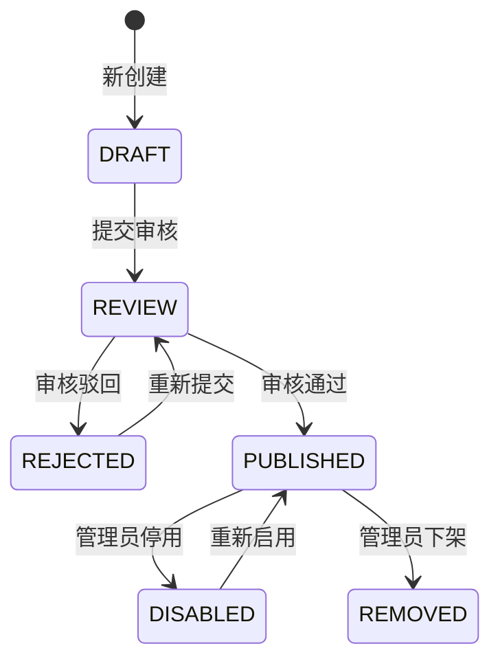

# 📋 应用商店产品需求文档（PRD）

**文档版本：** V2.1  
**编制日期：** 2026年5月15日  
**编制人：** AIPM产品经理  
**状态：** 🟢 待评审

---

## 版本历史

| 版本 | 日期 | 修订人 | 修订内容 |
|-----|------|-------|---------|
| V1.0 | 2026-05-14 | AIPM | 初始版本（基础应用商店功能） |
| V2.0 | 2026-05-15 | AIPM | 重大升级：完整生命周期/工具插件区分/OS管理/数据集关联/审核/授权体系 |
| V2.1 | 2026-05-15 | AIPM | ✅ 关键补充：数据集-工具关联打开机制<br>• 数据集表增加default_app_id字段<br>• "文件打开方式"交互流程<br>• 本地客户端调用协议<br>• 授权与安装检查流程 |

---

## GAP分析（V2.0 新增亮点）

| 模块 | V1.0 | V2.1 | 改进说明 |
|-----|------|------|---------|
| 数据集打开 | ❌ 无关联机制 | ✅ default_app_id + 调用协议 | 类似Windows"打开方式"，自动调用本地工具 |
| 应用类型 | ❌ 无区分 | ✅ 工具软件/插件分类 | 支持不同类型应用差异化管理 |
| 生命周期 | ⚠️ 仅简单上下架 | ✅ 6状态完整流转 | 草稿/审核中/驳回/已发布/已停用/已下架 |
| OS适配 | ❌ 缺失 | ✅ OS清单+适配配置 | 支持多操作系统、版本范围适配 |
| 插件依赖 | ❌ 缺失 | ✅ 宿主+版本范围 | 插件可指定适用工具软件及版本 |
| 审核流程 | ❌ 缺失 | ✅ 完整审核机制 | 自动检测+人工审核+驳回重提 |
| 授权管理 | ⚠️ 简单标签 | ✅ 完整授权体系 | 个人/企业授权、到期管理、分配回收 |

---

## 目录

1. [产品概述](#1-产品概述)
2. [核心概念定义](#2-核心概念定义)
3. [数据集-工具关联机制【V2.1新增核心】](#3-数据集-工具关联机制v21新增核心)
4. [用户角色与场景](#4-用户角色与场景)
5. [功能清单](#5-功能清单)
6. [生命周期状态机](#6-生命周期状态机)
7. [数据模型设计](#7-数据模型设计)
8. [前台页面设计](#8-前台页面设计)
9. [管理后台设计](#9-管理后台设计)
10. [审核流程](#10-审核流程)
11. [购买授权流程](#11-购买授权流程)
12. [非功能需求](#12-非功能需求)

---

## 1. 产品概述

### 1.1 产品定位

应用商店是Ragentic Cube Suite平台的工具应用市场，参考Apple Store/Android Store设计理念，为用户提供工具软件、插件的一站式搜索、购买、下载、安装、更新、授权管理服务。

**核心差异化价值：数据集-工具智能关联打开机制**
> 类似Windows"打开方式"，数据集绑定默认工具，一键调用本地已安装的工具客户端打开文件，无缝集成体验。

---

## 2. 核心概念定义

### 2.1 应用类型

| 类型 | 定义 | 示例 |
|------|------|------|
| **工具软件** | 可独立运行的完整应用程序 | CATIA集成客户端、PDQ质检工具 |
| **插件** | 依赖宿主工具运行的功能扩展 | CATIA数据导出插件、PDQ自定义规则包 |

### 2.2 应用状态（6状态）



| 状态码 | 状态名 | 说明 | 前台可见性 |
|-------|-------|------|-----------|
| DRAFT | 草稿 | 编辑中，信息不完整 | ❌ 不可见 |
| REVIEW | 审核中 | 已提交审核，等待管理员处理 | ❌ 不可见 |
| REJECTED | 已驳回 | 审核不通过，需修改后重提 | ❌ 不可见 |
| PUBLISHED | 已发布 | 审核通过，正常上架 | ✅ 可见 |
| DISABLED | 已停用 | 临时下架，保留数据 | ❌ 不可见 |
| REMOVED | 已下架 | 永久下架，历史记录保留 | ❌ 不可见 |

### 2.3 操作系统清单

```
┌─────────────────────────────────────────────────────┐
│              支持的操作系统清单                        │
├─────────────────────────────────────────────────────┤
│                                                         │
│  ┌──────────────────────────────────────────────┐  │
│  │ Windows                                      │  │
│  │  ├── Windows 10 (20H2/21H1/21H2/22H2)       │  │
│  │  ├── Windows 11 (21H2/22H2/23H2)            │  │
│  │  └── Windows Server (2019/2022)              │  │
│  └──────────────────────────────────────────────┘  │
│                                                         │
│  ┌──────────────────────────────────────────────┐  │
│  │ Linux                                        │  │
│  │  ├── CentOS (7/8/9)                          │  │
│  │  ├── Ubuntu (18.04/20.04/22.04)              │  │
│  │  └── Red Hat Enterprise Linux (8/9)           │  │
│  └──────────────────────────────────────────────┘  │
│                                                         │
│  ┌──────────────────────────────────────────────┐  │
│  │ macOS                                        │  │
│  │  ├── macOS 11 Big Sur                        │  │
│  │  ├── macOS 12 Monterey                       │  │
│  │  └── macOS 13 Ventura                        │  │
│  └──────────────────────────────────────────────┘  │
└─────────────────────────────────────────────────────┘
```

---

## 3. 数据集-工具关联机制【V2.1新增核心】

### 3.1 核心设计思想

> 💡 **类似Windows的"打开方式"**
>
> 每个数据集类型有**默认绑定工具**，点击打开时自动检测本地安装状态，授权有效则直接拉起本地工具客户端打开文件，实现无缝体验。

### 3.2 交互流程总图

```mermaid
flowchart TD
    A[用户点击"打开数据集"] --> B{读取数据集default_app_id}
    
    B -->|未配置默认工具| C[弹出"选择打开方式"]
    C --> D[用户选择工具]
    D --> E[可勾选"设为默认打开方式"]
    E --> F{检查授权状态}
    
    B -->|已配置默认工具| F
    
    F -->|未授权| G[提示"需先购买授权"]
    G --> H[跳转到应用商店详情页]
    H --> I[用户完成购买流程]
    I --> J{检查本地安装状态}
    
    F -->|已授权| J
    
    J -->|未安装| K[弹出"立即安装"提示]
    K --> L[自动拉起应用商店安装器]
    L --> M[用户完成安装]
    M --> N[调用本地客户端打开文件]
    
    J -->|已安装| N
    
    N --> O[✓ 文件打开成功]
```

### 3.3 本地客户端调用协议（URL Scheme）

**协议名称：** `ragentic://`

**调用格式示例：**

```bash
# 打开CATIA文件
ragentic://tool/catia/open?dataset_id=xxx-xxx-xxx&token=xxx&file_path=xxx.CATPart

# 打开PDQ检查
ragentic://tool/pdq/check?dataset_id=xxx-xxx-xxx&rule_id=R001

# 通用打开接口
ragentic://tool/{app_code}/open?dataset_id={数据集ID}&token={临时访问令牌}
```

**协议参数说明：**

| 参数 | 必填 | 说明 |
|------|------|------|
| app_code | ✅ | 工具唯一编码（如CATIA, PDQ, BOM等） |
| dataset_id | ✅ | 数据集唯一ID |
| token | ✅ | 临时访问令牌（15分钟有效期） |
| file_path | ✅ | 文件本地路径（首次打开需下载） |
| open_mode | | READ只读/EDIT编辑，默认READ |

### 3.4 数据集表字段补充

**数据表：** `dataset` （数据集主表）

| 新增字段 | 类型 | 必填 | 说明 |
|---------|------|------|------|
| default_app_id | UUID | | 默认打开工具ID，关联app_base表<br>为空则提示用户选择 |
| default_open_mode | VARCHAR(32) | | 默认打开方式：<br>• DEFAULT - 使用默认工具<br>• PROMPT - 每次让用户选择 |
| supported_apps | JSON | | 支持的工具ID列表<br>```["app_id_1", "app_id_2"]``` |

### 3.5 数据集-工具关联关系表

**表名：** `dataset_tool_support`

| 字段名 | 类型 | 必填 | 说明 |
|-------|------|------|------|
| id | UUID | ✅ | 主键 |
| dataset_id | UUID | ✅ | 数据集ID |
| app_id | UUID | ✅ | 支持的工具ID |
| is_default | BOOLEAN | | 是否该数据集类型的默认工具 |
| priority | INT | | 优先级（数字越小越靠前展示） |
| support_start_ver | VARCHAR(32) | | 最低支持版本 |
| support_end_ver | VARCHAR(32) | | 最高支持版本 |
| created_at | DATETIME | ✅ | |

### 3.6 页面交互设计

#### 交互1：打开数据集按钮

```
数据集详情页
┌─────────────────────────────────────────────┐
│ 电机模型.CATPart                         │
├─────────────────────────────────────────────┤
│ [打开]  [下载]  [关联工具▼]               │
│                                           │
│  大小: 15.2 MB | 版本: V1.3             │
│  默认工具: CATIA集成客户端                 │
└─────────────────────────────────────────────┘
```

#### 交互2：选择打开方式弹窗

```
┌─────────────────────────────────────────────────────┐
│                   选择打开方式                    ×  │
├─────────────────────────────────────────────────────┤
│  请选择要使用的工具：                                 │
│                                                         │
│  ┌─────────────────────────────────────────────────┐│
│  │ ✅ CATIA集成客户端                              ││
│  │    已授权 ✓ 已安装 ✓ 最新版本                   ││
│  ├─────────────────────────────────────────────────┤│
│  │   PDQ质检工具                                  ││
│  │    已授权 ✓ 已安装 ✓ 版本更新可用               ││
│  ├─────────────────────────────────────────────────┤│
│  │ ⏳ BOM导出工具                                  ││
│  │    未授权，点击购买 →                          ││
│  └─────────────────────────────────────────────────┘│
│                                                         │
│  [√] 设为默认打开方式，下次不再提示                    │
│                                                         │
│                              [取消]  [确认打开]       │
└─────────────────────────────────────────────────────┘
```

#### 交互3：未授权提示

```
┌─────────────────────────────────────────────────────┐
│                    操作提示                        ×  │
├─────────────────────────────────────────────────────┤
│                                                         │
│          🔐 需要购买授权才能使用此工具                  │
│                                                         │
│  您当前未购买"CATIA集成客户端"的使用授权。             │
│                                                         │
│  价格：¥ 999 / 年 / 用户                                 │
│                                                         │
│  [去应用商店了解详情]  [立即购买]                      │
└─────────────────────────────────────────────────────┘
```

#### 交互4：未安装提示

```
┌─────────────────────────────────────────────────────┐
│                    操作提示                        ×  │
├─────────────────────────────────────────────────────┤
│                                                         │
│          📦 需要安装本地客户端                          │
│                                                         │
│  您还未安装"CATIA集成客户端"，是否立即安装？            │
│                                                         │
│  版本：V2.1.0   大小：125 MB                           │
│                                                         │
│  [取消]  [立即安装]                                   │
└─────────────────────────────────────────────────────┘
```

### 3.7 数据集管理后台关联配置页

```
┌─────────────────────────────────────────────────────────────────┐
│ 数据集类型管理 > 三维模型 > 工具关联配置                      │
├─────────────────────────────────────────────────────────────────┤
│                                                                 │
│  当前数据集类型：CATIA三维模型 (.CATPart/.CATProduct)         │
│                                                                 │
│  [+ 添加支持工具]                                                │
│                                                                 │
│ ┌─────────────────────────────────────────────────────────────┐│
│ │ 工具名称          │ 默认打开 │ 版本范围     │ 优先级 │ 操作  ││
│ ├─────────────────────────────────────────────────────────────┤│
│ │ CATIA集成客户端 │ ✅ 是   │ V2.0.0+     │ 1       │ 编辑/删除 ││
│ │ PDQ质检工具      │ ❌ 否   │ V3.0.0+     │ 2       │ 编辑/删除 ││
│ └─────────────────────────────────────────────────────────────┘│
│                                                                 │
│  说明：优先级越小，在选择列表中越靠前；                        │
│       只有一个工具可设为默认打开方式。                           │
│                                                                 │
│  [保存]                                                         │
└─────────────────────────────────────────────────────────────────┘
```

---

## 4. 用户角色与场景

### 4.1 用户角色矩阵

| 角色 | 前台操作 | 管理后台操作 |
|------|---------|-------------|
| 👤 **普通用户** | 浏览/搜索/购买/安装/评价 | ❌ 无管理权限 |
| 🏢 **企业管理员** | 企业授权内应用可安装 | ✅ 查看企业授权、分配给成员 |
| 👨‍💻 **应用开发者** | 同普通用户 | ✅ 新增/编辑自己的应用、提交审核 |
| 🔍 **审核员** | 同普通用户 | ✅ 审核应用、驳回/通过 |
| ⚙️ **系统管理员** | 同普通用户 | ✅ 全部权限：OS管理/分类管理/授权管理/应用下架 |

### 4.2 核心用户场景

#### 场景1：设计师打开CATIA数据集【V2.1新增核心场景】
> 李工在数据集中看到一个CATIA模型，想直接打开查看。

**用户流程：**
1. 点击数据集"电机模型.CATPart"的【打开】按钮
2. 系统检测已配置默认工具：CATIA集成客户端
3. ✅ 检查授权有效，✅ 检查已安装最新版本
4. 自动调用 `ragentic://tool/catia/open?xxx` 协议
5. 本地CATIA客户端启动，自动加载并打开文件

---

#### 场景2：设计师安装CATIA工具（前台）
> 新用户李工需要安装CATIA集成客户端。

**用户流程：**
1. 打开应用商店
2. 找到"CATIA集成客户端"
3. 查看应用详情（功能介绍、系统要求、用户评价）
4. 确认适配当前系统（系统自动检测提示）
5. 点击"购买"，选择个人授权/1年
6. 完成支付流程
7. 授权生效，按钮变为"立即安装"
8. 自动下载→安装→完成

---

#### 场景3：管理员发布新PDQ工具（管理后台）
> 管理员需要发布新的PDQ检查工具。

**用户流程：**
1. 进入应用商店管理后台
2. 点击"新增应用"
3. 填写基本信息（名称、分类、图标、描述）
4. 选择应用类型：工具软件
5. 配置OS适配：Windows 10/11，选择版本范围
6. 新增版本：上传安装包、填写版本号、变更日志
7. 配置数据集关联：PDQ规则库、标准库数据集
8. 上传截图/附件
9. 提交审核
10. 审核员审核通过 → 自动上架

---

## 5. 功能清单

### 5.1 前台功能（P0核心）

| 模块 | 功能点 | 优先级 |
|-----|--------|-------|
| **数据集打开【V2.1新增】** | 一键打开（拉起本地工具） | P0 |
| | 选择打开方式弹窗 | P0 |
| | 默认工具设置与记忆 | P0 |
| | 授权检查与引导购买 | P0 |
| | 安装检查与引导安装 | P0 |
| | 本地客户端URL协议调用 |